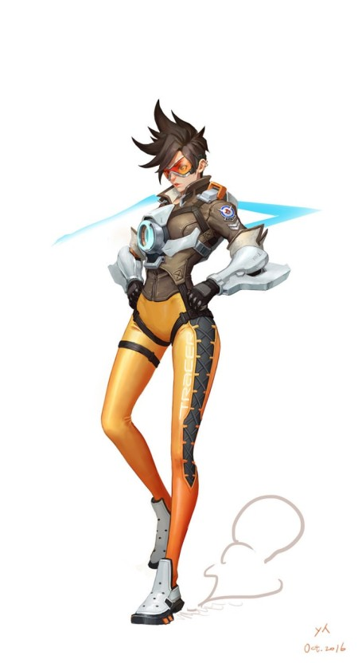

# CartoonRenderingImage
OpenCV를 이용한 Cartoon Rendering 작업!

## 설명
    1. 이미지를 축소한 후 다중 Bilateral Filtering을 적용하여 색 영역을 부드럽게 만듭니다.
    2. 원본 이미지를 그레이스케일로 변환하고 Gaussian Blur와 Laplacian 연산자를 이용해 엣지를 검출합니다.
    3. 검출된 엣지에 이진화 및 형태학적 팽창을 적용하여 경계선을 강화합니다.
    4. 부드러운 색상 이미지와 엣지 마스크를 결합하여 최종 만화 효과 이미지를 생성합니다.
    
## 한계점
    1. Bilateral Filtering 및 Laplacian 엣지 검출은 파라미터 설정에 매우 민감합니다. 이미지에 따라 최적의 파라미터가 달라질 수 있으며, 모든 경우에 동일한 결과를 보장하지 않습니다.
    2. 매우 어둡거나 밝은 이미지에서는 엣지 검출이 제대로 작동하지 않아 부자연스러울 수 있습니다.
    3. 이미지의 배경이 지나치게 복잡한 경우, 알고리즘이 노이즈와 세부사항을 충분히 제거하지 못해 결과물이 흐릿하거나 부자연스럽게 표현될 수 있습니다.  
    4. 반복적 Bilateral Filtering은 이미지의 세부정보를 지나치게 제거할 수 있으며, 이로 인해 중요한 특징이 소실될 가능성이 있습니다.
    5. 실제 사람과 같은 예시에서는 윤곽 등 세부정보를 비교적 잘 담았으나, 캐릭터와 같은 실제성이 떨어지는 데이터에 대해서는 윤곽을 거의 담지 못하는 한계점이 있습니다.

## 실행예시(스크린샷)
<!-- Good image 예시 -->
<table>
  <tr>
    <td colspan="2" align="center"><strong>Good image 예시</strong></td>
  </tr>
  <tr>
    <td align="center"></td>
    <td align="center"></td>
  </tr>
</table>

<!-- Bad image 예시 -->
<table>
  <tr>
    <td colspan="2" align="center"><strong>Bad image 예시</strong></td>
  </tr>
  <tr>
    <td align="center"></td>
    <td align="center"></td>
  </tr>
</table>
